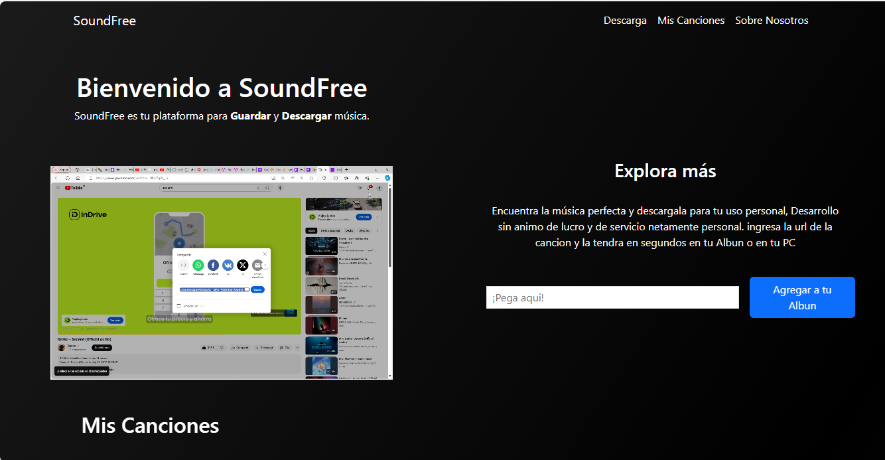
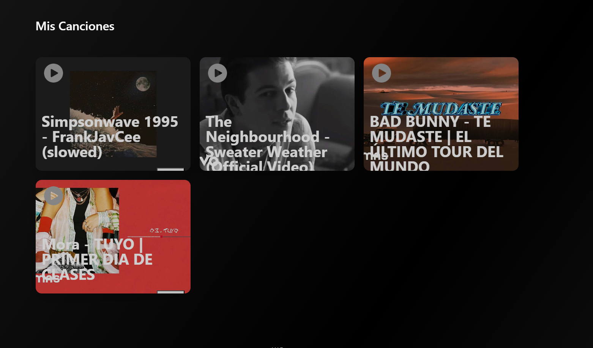

# Proyecto de Convertidor MP3

Como proyecto personal, y para satisfacer mi necesidad de descargar música sin anuncios en una biblioteca web, desarrollé un convertidor MP3 que automatiza el proceso de descarga de canciones desde YouTube y las almacena en una base de datos externa. Esto me permite acceder a mi lista de reproducción en línea de manera cómoda y sin interrupciones.

## Tecnología Utilizada:
Frontend: Angular (versión actual)
Backend: Python (versión actual) con Django y Django REST Framework
Base de Datos: PostgreSQL

## Home
En este apartado de la pagina se puede descargar la musica con la url de youtube

## Características del Proyecto:
Interfaz de Usuario en Angular: Utilicé Angular para desarrollar una interfaz de usuario intuitiva y responsiva, permitiendo una experiencia de usuario fluida y moderna.

Backend en Python: El backend está construido con Python y utiliza Django y Django REST Framework para manejar las solicitudes, la conversión de videos de YouTube a MP3 y la gestión de la base de datos.

Almacenamiento en Base de Datos: Las canciones convertidas se almacenan automáticamente en una base de datos externa, lo que permite un acceso rápido y organizado a la música.

Acceso en Línea: La lista de reproducción está disponible en línea, permitiendo escuchar las canciones desde cualquier dispositivo con acceso a Internet.

## Beneficios:
Sin Anuncios: Disfruta de tu música sin interrupciones publicitarias.

Automatización: El proceso de descarga y conversión es completamente automático.

Accesibilidad: Accede a tu música desde cualquier lugar y en cualquier momento.

Este proyecto no solo cumple con mis necesidades personales, sino que también ha sido una excelente oportunidad para mejorar mis habilidades en desarrollo web y manejo de bases de datos.

